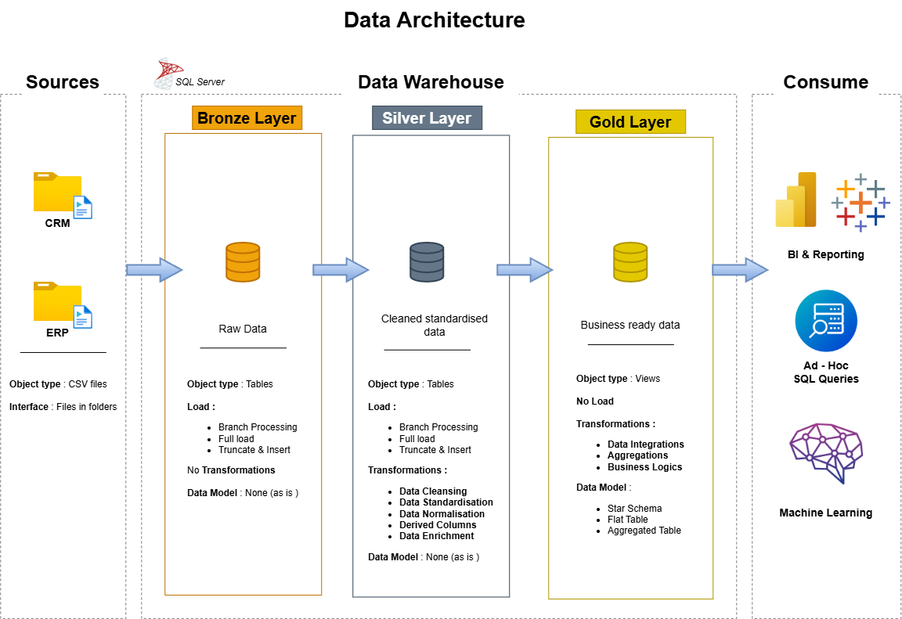

# 🏗️ SQL Data Warehouse & Analytics Project

An end-to-end data warehousing and analytics solution built entirely on **Microsoft SQL Server** — from raw CSV ingestion to a business-ready star schema and a Power BI dashboard. The project follows **Medallion Architecture** (Bronze → Silver → Gold) and is designed to reflect real-world data engineering practices: layered ETL, data quality checks, dimensional modeling, and SQL-based analytics.

---

## 📐 Data Architecture



| Layer | Purpose | Object Type | Key Actions |
|---|---|---|---|
| **Bronze** | Raw data, as-is from source systems | Tables | Truncate & bulk insert from CRM/ERP CSV files — no transformations |
| **Silver** | Cleaned, standardized, business-usable data | Tables | Data cleansing, standardization, normalization, derived columns, enrichment |
| **Gold** | Business-ready, consumption-layer data | Views | Data integration, aggregations, business logic, modeled as a **star schema** |

The Gold layer is queried directly for reporting, ad-hoc SQL analysis, and BI dashboards.

---

## 📂 Repository Structure

```
Sql_Data-Warehouse_Project/
│
├── datasets/                          # Source CSV files (as provided by ERP & CRM systems)
│   ├── source_crm/                    # cust_info, prd_info, sales_details
│   └── source_erp/                    # CUST_AZ12, LOC_A101, PX_CAT_G1V2
│
├── scripts/
│   ├── init.database.sql              # Creates the DataWarehouse DB + bronze/silver/gold schemas
│   ├── bronze/
│   │   ├── ddl_bronze.SQL             # Bronze table definitions
│   │   └── proc_load_bronze.SQL       # Bulk-loads raw CSVs into Bronze
│   ├── silver/
│   │   ├── ddl_silver.SQL             # Silver table definitions
│   │   └── proc_load_silver.SQL       # Cleans, standardizes & loads Bronze → Silver
│   └── gold/
│       └── ddl_gold.SQL               # Gold layer views: dim_customers, dim_products, fact_sales
│
├── tests/
│   ├── quality_checks_silver.sql      # Null/duplicate keys, whitespace, invalid dates, consistency
│   └── quality_checks_gold.sql        # Surrogate key uniqueness & referential integrity checks
│
├── EDA/                                # 13 SQL scripts: exploration → analysis → reporting
│   ├── 01_database_exploration.sql
│   ├── 02_dimensions_exploration.sql
│   ├── 03_date_range_exploration.sql
│   ├── 04_measures_exploration.sql
│   ├── 05_magnitude_analysis.sql
│   ├── 06_ranking_analysis.sql
│   ├── 07_change_over_time_analysis.sql
│   ├── 08_cumulative_analysis.sql
│   ├── 09_performance_analysis.sql
│   ├── 10_data_segmentation.sql
│   ├── 11_part_to_whole_analysis.sql
│   ├── 12_report_customers.sql        # gold.report_customers view
│   └── 13_report_products.sql         # gold.report_products view
│
├── Dashboard/
│   ├── Sales & Customer Insights Dashboard.pbix
│   └── Sale & Customer Insight Dashboard.png
│
├── docs/
│   └── data_architecture.png
│
├── LICENSE
└── README.md
```

---

## 🔄 ETL Workflow

**1. Bronze Layer — Ingestion**
`bronze.load_bronze` truncates and bulk-inserts the six source CSVs (three CRM, three ERP) as-is, with load duration logging for each table.

**2. Silver Layer — Cleansing & Standardization**
`silver.load_silver` transforms Bronze data before loading, including:
- Deduplication via `ROW_NUMBER()` (keeping the latest customer record per `cst_id`)
- Trimming whitespace and standardizing categorical codes (`M`/`F` → `Male`/`Female`, `S`/`M` → `Single`/`Married`)
- Deriving `prd_end_date` from the next product's start date using `LEAD()`
- Splitting composite product keys into category ID + product key
- Validating and rebuilding invalid sales dates and recalculating `sales_amount`/`price` where they're missing or inconsistent (`sales ≠ quantity × price`)
- Adding `dwh_create_date` audit columns

**3. Gold Layer — Business Model**
`ddl_gold.SQL` builds three consumption views on top of Silver, joining CRM and ERP data:
- **`gold.dim_customers`** — customer demographics, enriched with ERP gender/birthdate/country
- **`gold.dim_products`** — active products only, enriched with category/subcategory/maintenance info
- **`gold.fact_sales`** — sales transactions linked to both dimensions via surrogate keys

Two additional reporting views, **`gold.report_customers`** and **`gold.report_products`**, aggregate the star schema into ready-to-use KPIs (recency, lifespan, average order value, customer/product segments).

**4. Quality Assurance**
Dedicated test scripts validate Silver-layer cleanliness (nulls, duplicates, inconsistent formatting, invalid date ranges) and Gold-layer integrity (surrogate key uniqueness, dimension/fact relationships) before the model is trusted for reporting.

---

## 📊 Analytics & Reporting

The `EDA/` folder walks through a full analysis progression — database/dimension exploration, date ranges, key measures, magnitude and ranking analysis, time-over-time trends, cumulative and performance (YoY/MoM) analysis, segmentation, and part-to-whole comparisons — before culminating in two reusable reporting views:

- **`gold.report_customers`** — segments customers into VIP / Regular / New and age bands; tracks total orders, sales, quantity, recency, and average order/monthly revenue.
- **`gold.report_products`** — segments products into High / Mid / Low performers by revenue; tracks total orders, sales, quantity sold, and product lifespan.

### Power BI Dashboard


Built on the Gold layer, the dashboard (`Dashboard/Sales & Customer Insights Dashboard.pbix`) surfaces:
- Headline KPIs — total sales, orders, customers, quantity, and average order value
- Monthly sales trend over time
- Sales by product category
- Customer segmentation (VIP / Regular / New)
- Product performance (High / Mid / Low performers)
- Top 10 products by sales

---

## 🛠️ Tools & Technologies

| Tool | Purpose |
|---|---|
| **Microsoft SQL Server / SSMS** | Database engine and development environment |
| **T-SQL** | DDL, stored procedures, views, window functions |
| **Power BI** | Dashboard and visual analytics |
| **Draw.io** | Data architecture diagram |
| **Git & GitHub** | Version control |

---

## 🚀 Getting Started

1. Install **SQL Server** (Express is sufficient) and **SQL Server Management Studio (SSMS)**.
2. Run `scripts/init.database.sql` to create the `DataWarehouse` database and the `bronze` / `silver` / `gold` schemas.
3. Run the DDL scripts to create tables/views, in order:
   `bronze/ddl_bronze.SQL` → `silver/ddl_silver.SQL` → `gold/ddl_gold.SQL`
4. Update the file paths inside `bronze/proc_load_bronze.SQL` to point to your local copy of the `datasets/` folder, then execute:
   ```sql
   EXEC bronze.load_bronze;
   EXEC silver.load_silver;
   ```
5. Run `tests/quality_checks_silver.sql` and `tests/quality_checks_gold.sql` to validate the build.
6. Explore the data using the scripts in `EDA/`, or query the Gold views directly for reporting.
7. Open `Dashboard/Sales & Customer Insights Dashboard.pbix` in Power BI to view/refresh the dashboard against your local database.

---

## 🎯 Skills Demonstrated

- Data warehouse design using **Medallion Architecture** (Bronze/Silver/Gold)
- ETL pipeline development with **stored procedures**
- Data cleaning, standardization, and **data quality testing**
- **Dimensional modeling** — star schema (fact & dimension tables)
- Advanced **T-SQL**: window functions, CTEs, `LEAD()`/`LAG()`, surrogate keys
- Exploratory data analysis and **KPI reporting** in pure SQL
- **BI dashboard** development in Power BI

---

## 📄 License

This project is licensed under the [MIT License](LICENSE) — free to use, modify, and share with attribution.

---

## 👤 About the Author

**Muhammed Swalih**

I'm passionate about transforming raw data into meaningful insights through data analysis, visualization, and storytelling. I enjoy working with datasets, uncovering patterns, and building dashboards that support data-driven decisions.

- 🔗 GitHub: [@muhammed-swalih296](https://github.com/muhammed-swalih296)
- 💼 LinkedIn: www.linkedin.com/in/muhammedswalih2
- 📧 Email: muhammedswalih.mail@gmail.com

> Feel free to explore the repo, raise an issue, or connect — always open to feedback and collaboration on data analytics projects.
